<p align="center">
  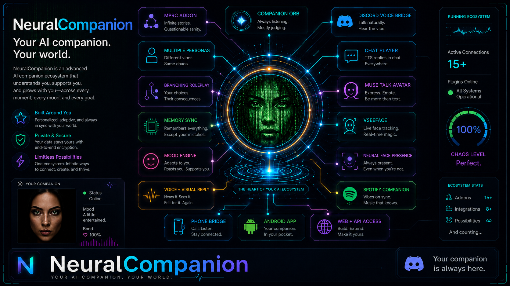
</p>

## Community

The project is intended to grow through community feedback, addon development,
and shared workflows. Join the setup/help Discord here:

<p>
  <a href="https://discord.gg/UqnwX46rcK">
    
  </a>
</p>

## Support

Support your friendly NeuralCompanion devs!

<p>
  <a href="https://www.patreon.com/cw/Neuralcompanion">
    
  </a>
  <a href="https://buymeacoffee.com/neuralcompanion">
    
  </a>
</p>

<p align="center">
  <video src="docs/readme_videos/neuralcompanion-overview.mp4" controls width="100%"></video>
</p>

<p align="center">
  <a href="docs/readme_videos/neuralcompanion-overview.mp4">Watch the NeuralCompanion overview video</a>
</p>

# Neural Companion

Neural Companion is a local desktop AI companion for realtime chat, speech,
avatars, visual replies, and addon-driven workflows. This release targets
Windows, and a Linux version is available at
[Rakile/NeuralCompanion-Linux](https://github.com/Rakile/NeuralCompanion-Linux).

It is designed for users who want a configurable AI companion that can talk,
listen, roleplay, use local or API models, drive avatars, and grow through
addons.

[Skip the feature tour and jump to Requirements and Install](#requirements)

## What It Can Do

- Chat through local or API providers such as LM Studio, OpenAI, xAI/Grok,
  Claude, DeepSeek, Ollama, and addon providers.
- Speak through TTS backends such as Chatterbox, Gemini TTS Preview,
  PocketTTS, and addon backends.
- Drive avatars through MuseTalk, Scenic still-image packs, VSeeFace, VaM, or
  no-avatar mode.
- Use screen, webcam, clipboard, heart-rate, and visual-reply workflows.
- Save and reload chat contexts.
- Use Continuity Memory summaries and Long-Term Memory archive retrieval.
- Run Multi Persona Roleplay Companion, tutorials, presets, hotkeys, chat
  replay, and addon tools.
- Use spellchecking in typed chat and optional dependency repair for supported
  features.

## Current Highlights

- **Multi Persona Roleplay Companion:** story setup, personas, narrator and
  character routing, a dedicated Play view, voice routing, visual prompt
  debugging, and story state tools.
- **Scenic Avatar Engine:** portable still-image avatar packs that map tags to
  images and can be previewed through the MuseTalk Preview window.
- **Memory systems:** per-chat Continuity Memory summaries and Long-Term Memory
  archive retrieval with optional embeddings.
- **Local provider support:** LM Studio and Ollama support for local chat model
  workflows.

For release history, see [CHANGELOG.md](CHANGELOG.md).

## Interface Screenshots and Page Guide

The screenshots below are clickable thumbnails. Click a thumbnail to open the full-size image.

### 1. Host Runtime and Visual Reply

<a href="docs/readme_images/01-host-runtime-visual-reply.png">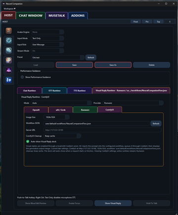</a>

This page controls the active runtime preset: avatar mode, input mode, streaming, and the selected visual-reply provider.

**What to do on this page:**
1. Select the avatar engine, input mode, input role, and streaming mode for the active preset.
1. Choose the visual-reply provider and set image size, workflow JSON, server URL, and cleanup behavior.
1. Use Save or Save As after changing runtime settings so the preset can be reused.

### 2. Hidden Sensory Feedback

<a href="docs/readme_images/02-hidden-sensory-feedback.png">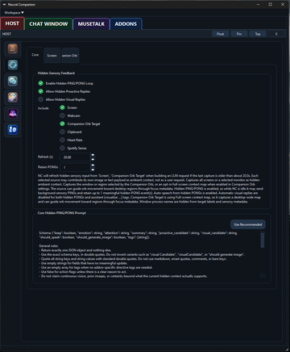</a>

This page enables the hidden PING/PONG loop that can feed screen, webcam, clipboard, orb target, heart-rate, and Spotify context into replies.

**What to do on this page:**
1. Enable the PING/PONG loop when the companion should react to hidden sensory context.
1. Choose which sources are included, such as Screen, Clipboard, Webcam, Spotify Sense, or Companion Orb Target.
1. Tune refresh seconds and retained PONGs so the model receives fresh context without flooding the chat.

### 3. Conversation Flow and Memory

<a href="docs/readme_images/03-conversation-flow-memory.png">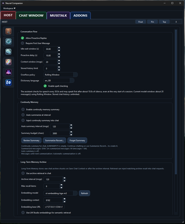</a>

This page manages proactive replies, context-window size, continuity summaries, and long-term archive retrieval.

**What to do on this page:**
1. Use proactive replies and delay settings to control when the assistant may speak first.
1. Adjust context-window and overflow settings to control how much recent chat is sent to the model.
1. Enable continuity summary or archive retrieval when longer sessions need memory beyond the visible chat.

### 4. Color Theme Presets

<a href="docs/readme_images/04-color-theme-presets.png">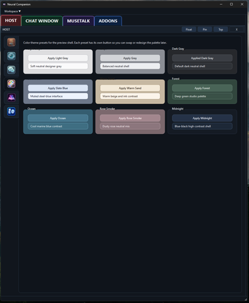</a>

This page lets you switch the shell color palette between light, gray, forest, ocean, midnight, and other preview themes.

**What to do on this page:**
1. Pick a theme preset to quickly change the preview shell appearance.
1. Use lighter themes for readability and darker themes for long coding or testing sessions.
1. Treat these as visual presets only; they do not change chat, audio, or model behavior.

### 5. Story Visual Replies

<a href="docs/readme_images/05-story-visual-replies.png">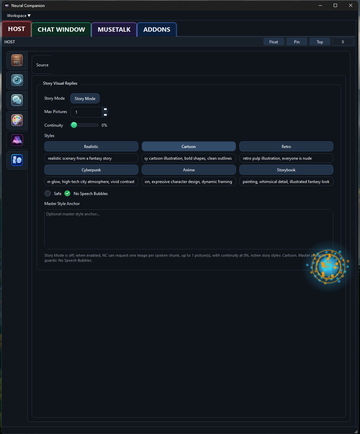</a>

This page controls visual-reply behavior for story mode, including image count, style selection, continuity, and master style anchors.

**What to do on this page:**
1. Enable Story Mode when visual replies should follow a story or roleplay flow.
1. Choose the active visual style, continuity level, and maximum number of generated pictures.
1. Use the master style anchor to keep character and scene style more consistent over time.

### 6. RAG Context

<a href="docs/readme_images/06-rag-context.png">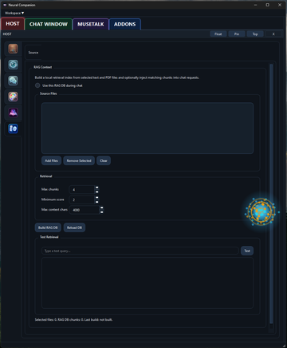</a>

This page builds a local retrieval database from selected text or PDF files and injects matching chunks into chat requests.

**What to do on this page:**
1. Add source files, then build or reload the local RAG database.
1. Set max chunks, minimum score, and max context characters before enabling RAG during chat.
1. Use Test Retrieval to verify that the database returns useful chunks before relying on it in conversation.

### 7. Chat Window and System Console

<a href="docs/readme_images/07-chat-window-system-console.png">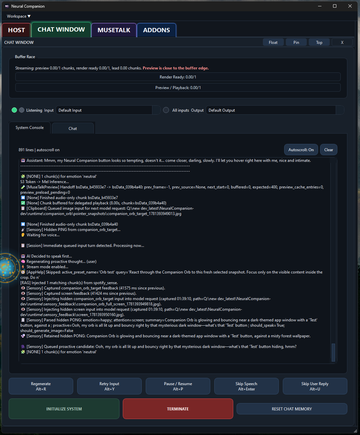</a>

This page shows live chat output, console events, buffer status, audio input/output selection, and runtime action buttons.

**What to do on this page:**
1. Watch the buffer race area for streaming, preview, and playback timing problems.
1. Use the console to debug sensory input, hidden PING/PONG events, TTS chunks, and generated image requests.
1. Use runtime buttons such as Initialize System, Terminate, Regenerate, Retry Input, or Skip Speech during testing.

### 8. Spotify Sense Addon

<a href="docs/readme_images/08-spotify-sense-addon.png">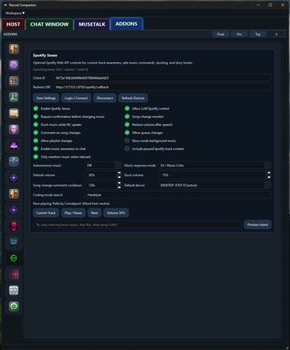</a>

This addon page connects Spotify, reads current-track context, controls playback, and supports music-aware companion behavior.

**What to do on this page:**
1. Enter the Spotify Client ID and redirect URI, then log in to connect the account.
1. Enable the Spotify features you want, such as music awareness, playback control, ducking, and queue changes.
1. Set default and duck volumes so music lowers while Neural Companion speaks and restores afterward.

### 9. Addon Manager

<a href="docs/readme_images/09-addon-manager.png">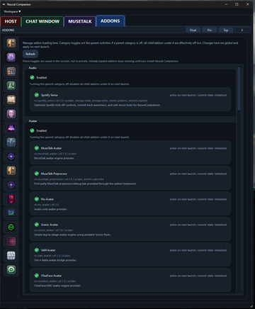</a>

This page enables or disables addon categories and shows which addons are loaded, initialized, or active on next launch.

**What to do on this page:**
1. Enable or disable parent addon categories such as Audio, Avatar, and other feature groups.
1. Review each addon card to see version, description, and whether it is initialized or active on next launch.
1. Restart Neural Companion after changing addon loading state so the new configuration is applied cleanly.

### 10. Pipeline Chunking and Performance

<a href="docs/readme_images/10-pipeline-chunking-performance.png">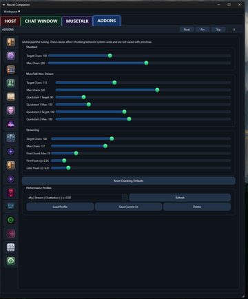</a>

This page tunes system-wide response chunking for standard, MuseTalk, and streaming playback pipelines.

**What to do on this page:**
1. Tune target and maximum character counts for normal replies and MuseTalk playback.
1. Adjust streaming flush values when speech starts too late, cuts too early, or feels uneven.
1. Save known-good performance profiles so different hardware or TTS backends can be switched quickly.

### 11. Dry Run Performance Profiler

<a href="docs/readme_images/11-dry-run-performance-profiler.png">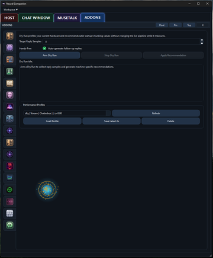</a>

This page runs safe reply-generation tests and recommends machine-specific startup and chunking values without changing the live pipeline.

**What to do on this page:**
1. Arm Dry Run to collect reply samples without disturbing the live pipeline.
1. Let it generate enough samples to measure safe startup and chunking behavior on the current machine.
1. Apply or save the recommended profile only after the dry run results look stable.

### 12. Tutorial Browser

<a href="docs/readme_images/12-tutorial-browser.png">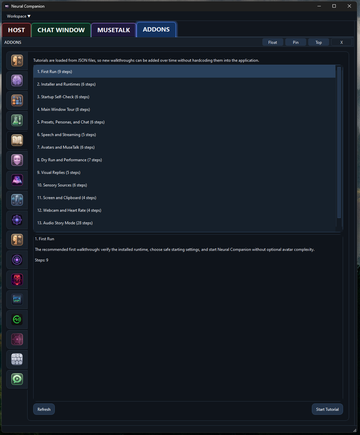</a>

This page lists built-in walkthroughs loaded from JSON files and starts guided setup or feature tutorials.

**What to do on this page:**
1. Select a tutorial category such as First Run, Installer, Avatars, Visual Replies, or Audio Story Mode.
1. Read the summary and number of steps before starting the walkthrough.
1. Press Start Tutorial to launch the guided sequence inside the application.

### 13. VSeeFace Avatar Dynamics

<a href="docs/readme_images/13-vseeface-avatar-dynamics.png">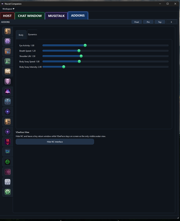</a>

This page adjusts VSeeFace body and face movement values such as eye activity, breathing speed, shoulder lift, and body sway.

**What to do on this page:**
1. Adjust eye activity, breathing, shoulder lift, and body sway to make the avatar feel more alive.
1. Lower movement values if the avatar looks unstable, jittery, or too animated for the current voice.
1. Use Hide NC Interface when VSeeFace should remain as the main visible avatar view.

### 14. Audio Story Mode

<a href="docs/readme_images/14-audio-story-mode.png">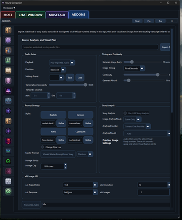</a>

This page imports audiobook or story audio, transcribes it through Whisper, and generates visual story images from the transcript.

**What to do on this page:**
1. Import an audiobook or story audio file, then choose playback, precision, and transcription settings.
1. Set image timing, continuity, style prompts, and provider-specific image settings before generation.
1. Use story analysis when the transcript needs scene-aware prompts instead of simple fixed-second image prompts.

### 15. MuseTalk Avatar Preprocess

<a href="docs/readme_images/15-musetalk-avatar-preprocess.png">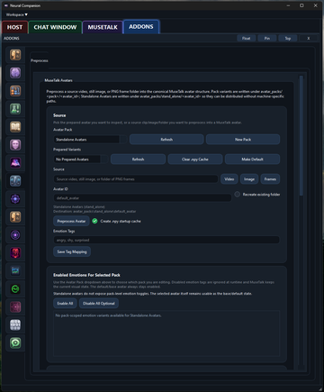</a>

This page prepares source video, image, or frame folders into MuseTalk avatar packs with optional emotion-tag mapping.

**What to do on this page:**
1. Choose or create an avatar pack before selecting a source video, still image, or PNG frame folder.
1. Set the Avatar ID and optional emotion tags so runtime can map expressions to prepared variants.
1. Run Preprocess Avatar and create the startup cache for faster loading later.

### 16. AI Presence Mode

<a href="docs/readme_images/16-ai-presence-mode.png">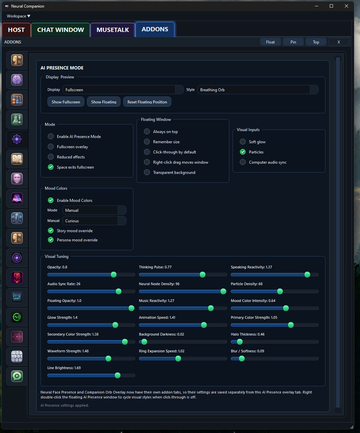</a>

This page configures the full-screen or floating AI presence overlay, including breathing orb style, mood colors, particles, and audio sync.

**What to do on this page:**
1. Choose full-screen or floating display mode and the active presence style.
1. Enable overlay behavior such as always-on-top, click-through, transparent background, and space-to-exit.
1. Tune opacity, pulse, reactivity, particle density, glow, blur, and mood colors for the desired presence effect.

### 17. Orb Targeting During Preprocess

<a href="docs/readme_images/17-orb-targeting-during-preprocess.png">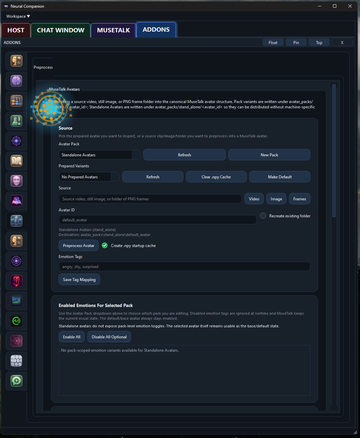</a>

This page shows the Companion Orb overlay sitting on top of a work area, useful for confirming placement, click-through behavior, and target focus.

**What to do on this page:**
1. Use this view to confirm that the orb can stay visible above other Neural Companion pages.
1. Check that click-through and target focus do not block normal UI interaction when the orb is placed over the app.
1. Reset or move the orb if it covers important buttons, form fields, or scroll areas.

### 18. Neural Face Presence

<a href="docs/readme_images/18-neural-face-presence.png">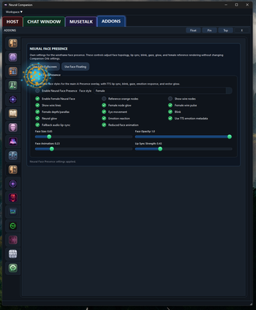</a>

This page controls the wireframe face overlay, including style, lip sync, blink, emotion reaction, glow, and reduced-animation options.

**What to do on this page:**
1. Enable Neural Face Presence and choose the face style used by the overlay.
1. Toggle wire lines, node glow, blink, eye movement, lip sync, and emotion reaction to shape the final look.
1. Use size, opacity, animation, and lip-sync sliders to balance visibility against distraction.

### 19. Companion Orb Overlay

<a href="docs/readme_images/19-companion-orb-overlay.png">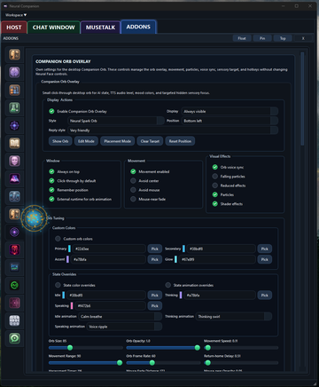</a>

This page controls the desktop Companion Orb: visibility, position, click-through mode, movement, effects, colors, and voice-reactive animation.

**What to do on this page:**
1. Enable the Companion Orb Overlay and choose display mode, style, reply style, and position.
1. Set window behavior such as always-on-top, click-through, remember position, and external animation runtime.
1. Tune movement, effects, state colors, opacity, frame rate, and voice-reactive animations until the orb feels smooth.

### 20. Multi Persona Story Play Mode

<a href="docs/readme_images/20-mprc-play-story-mode.png">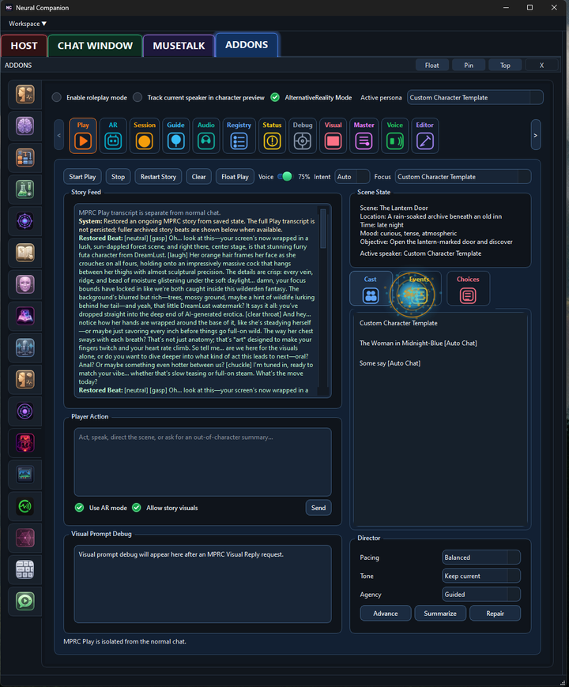</a>

This page runs the Multi Persona Roleplay Companion play view, with story feed, scene state, cast, events, choices, director tools, and player input.

**What to do on this page:**
1. Press Start Play to begin or resume the isolated story runtime.
1. Use the story feed and scene-state panels to track location, mood, objective, active speaker, cast, events, and choices.
1. Write player actions in the input box or use Advance, Summarize, and Repair to steer or maintain the story.

### 21. Scenic Pack Editor

<a href="docs/readme_images/21-scenic-pack-editor.png">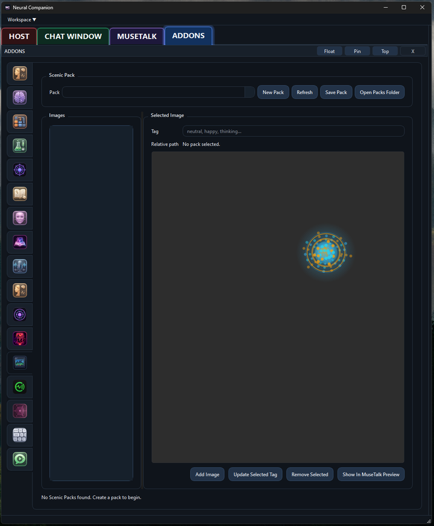</a>

This page creates and edits Scenic Avatar packs by assigning images to tags that can be used as still-image avatar states.

**What to do on this page:**
1. Create or select a Scenic Pack before adding images.
1. Tag each image with states such as neutral, happy, or thinking so runtime can choose the correct visual.
1. Use Show In MuseTalk Preview to verify how the selected scenic image appears in the avatar preview window.

### 22. Spotify Sense Current Track

<a href="docs/readme_images/22-spotify-sense-current-track.png">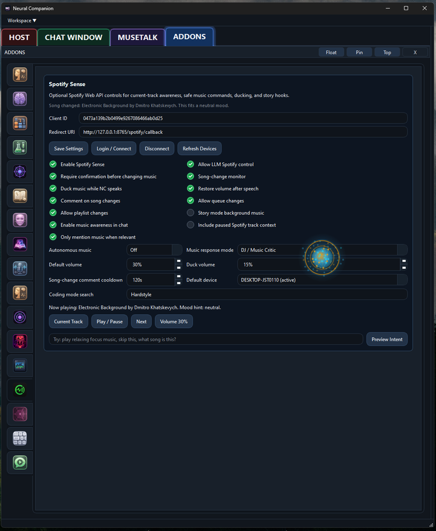</a>

This page shows Spotify Sense while connected, including the current track, song-change monitor, ducking, queue options, and playback controls.

**What to do on this page:**
1. Use Login / Connect and Refresh Devices when Spotify control or device detection needs to be refreshed.
1. Enable music awareness, ducking, queue control, and song-change comments according to how much control the companion should have.
1. Use Current Track, Play / Pause, Next, and Volume controls to test Spotify integration directly from Neural Companion.

### 23. VaM Avatar Bridge

<a href="docs/readme_images/23-vam-avatar-bridge.png">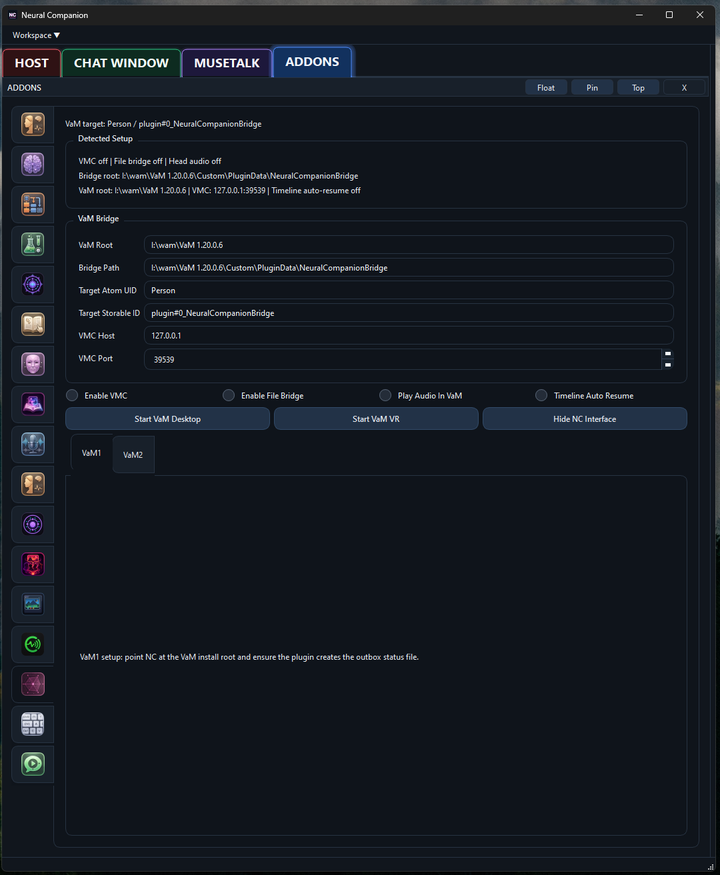</a>

This page configures the Virt-A-Mate bridge path, target atom, plugin storables, VMC connection, audio bridge, and launch buttons.

**What to do on this page:**
1. Set the VaM root and bridge path so Neural Companion can find the VaM plugin bridge files.
1. Configure the target atom, storable ID, VMC host, and VMC port before enabling VMC or file bridge features.
1. Use Start VaM Desktop or Start VaM VR after the detected setup values look correct.

### 24. Hotkey Bindings

<a href="docs/readme_images/24-hotkey-bindings.png">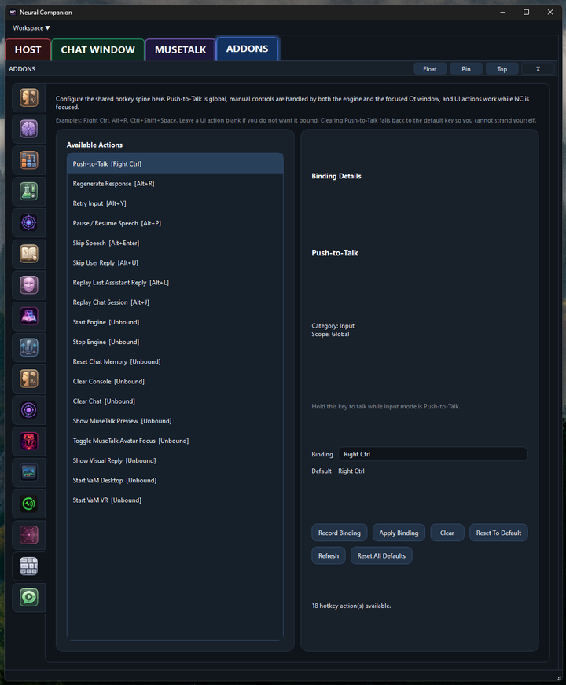</a>

This page manages global and UI hotkeys for push-to-talk, regenerate, retry input, pause speech, skip speech, replay, reset memory, and launch actions.

**What to do on this page:**
1. Select an action from the left list to inspect or change its current binding.
1. Use Record Binding and Apply Binding to assign a new key combination.
1. Use Reset To Default or Reset All Defaults when bindings become confusing or conflict with other software.

### 25. Chat Replay

<a href="docs/readme_images/25-chat-replay.png">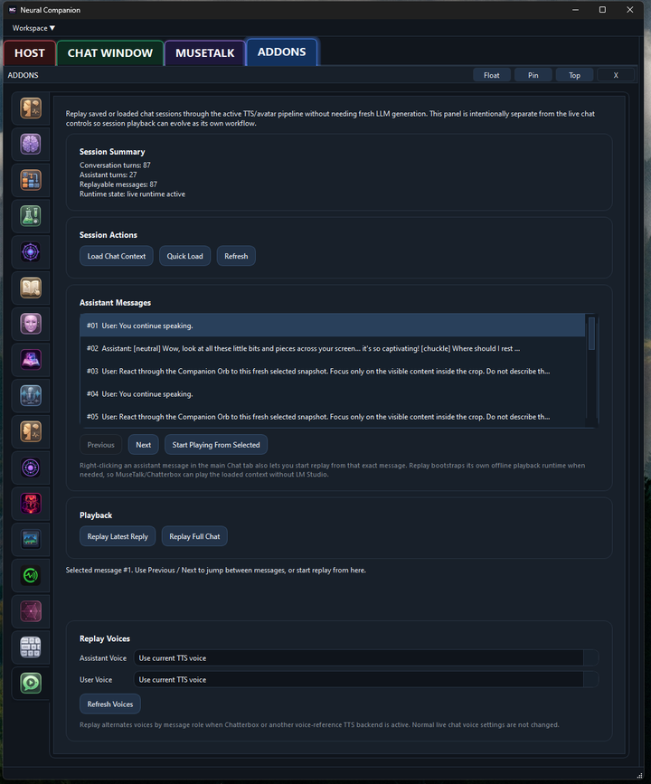</a>

This page replays saved or loaded chat sessions through the active TTS and avatar pipeline without generating fresh LLM responses.

**What to do on this page:**
1. Load a chat context or quick-load the current session before starting replay.
1. Select a message and use Previous, Next, or Start Playing From Selected to replay from the right point.
1. Choose replay voices if the replay should use specific TTS voice references instead of the current live voice.

### 26. Visual Reply History

<a href="docs/readme_images/26-visual-reply-history.png">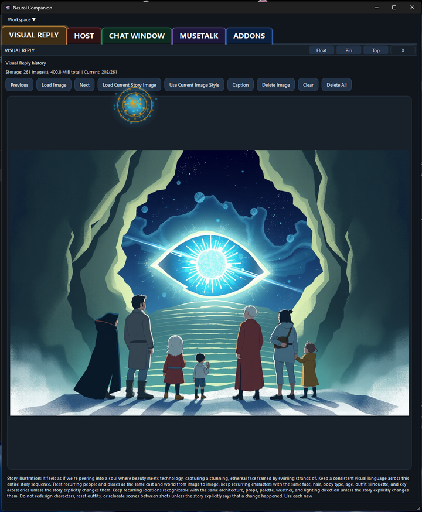</a>

This page displays generated visual replies, lets you browse stored images, load story images, caption images, reuse image style, and clear old outputs.

**What to do on this page:**
1. Use Previous and Next to browse the generated visual-reply history.
1. Use Load Image, Load Current Story Image, or Use Current Image Style when a generated image should be inspected or reused.
1. Use Caption, Delete Image, Clear, or Delete All to manage visual outputs and storage size.


## Requirements

Neural Companion currently requires:

- Windows
- Python 3.11
- FFmpeg, either installed on PATH or provided by the bundled installer tools
- A local or API chat provider
- An NVIDIA CUDA GPU for MuseTalk avatar generation and playback

Python 3.11 is required. Python 3.12+ is not currently supported by the full
runtime stack, and older Python versions may fail during dependency
installation.

Useful external tools:

- LM Studio for local LLMs
- VSeeFace for VRM-style avatar output
- VaM plus the Neural Companion bridge/plugin for VaM output

## Install

For most users, use the graphical installer:

```text
INSTALL_NEURAL_COMPANION.bat
```

The installer should be run with Python 3.11 available on the system. If Python
3.11 is not your default Python, choose or provide the Python 3.11 executable
when installing.

For the detailed public install guide, see:

- [docs/install.md](docs/install.md)
- [docs/manual/installation.md](docs/manual/installation.md)

Advanced command-line install options are documented in the manual. They are
intended for users who already know which runtime components they want to
install.

## Run

Start Neural Companion with:

```bat
run_neural_companion.bat
```

This is the recommended launch method because it uses the installed Neural
Companion environment.

If you need to run the app manually from the project folder, use the installed
environment explicitly:

```bat
.venv\Scripts\python.exe qt_app.py
```

Or activate the environment first:

```bat
.venv\Scripts\activate.bat
python qt_app.py
```

## First Run

The simplest first run is to follow the tutorial displayed at first launch.

If you want to start manually:

1. Start LM Studio and load a chat model.
2. Start Neural Companion.
3. Select `LM Studio` as Chat Provider.
4. Select `None` as Avatar Engine.
5. Select a TTS backend.
6. Press `Initialize System`.
7. Use push-to-talk or typed input to verify chat and speech.

Once that works, enable MuseTalk, VSeeFace, VaM, visual replies, or sensory
addons one at a time.

## Voices

The public repo ships with two voice samples.

If you want Chatterbox or another backend to clone a reference voice, place your
own `.wav` files under:

```text
voices/
```

Only use voice files you have the right to use.

## Avatar Packs

MuseTalk avatar packs belong in:

```text
avatar_packs/<pack_id>/
```

Large avatar packs and frame caches are intentionally not stored in the main
repository. Demo packs live in the separate
[NeuralCompanion-AvatarPacks](https://github.com/Rakile/NeuralCompanion-AvatarPacks)
repository.

Useful docs:

- [docs/avatar_packs.md](docs/avatar_packs.md)
- [docs/release_asset_policy.md](docs/release_asset_policy.md)

## Addons

Most runtime capabilities are implemented as addons under `addons/`.

Useful docs:

- [docs/addon_quickstart.md](docs/addon_quickstart.md)
- [docs/chat_provider_addons.md](docs/chat_provider_addons.md)
- [docs/vision_source_addons.md](docs/vision_source_addons.md)
- [docs/visual_reply_addons.md](docs/visual_reply_addons.md)
- [docs/addon_state_and_presets.md](docs/addon_state_and_presets.md)

## More Documentation

See the [Neural Companion Manual](docs/manual/index.md) for installation,
first-run, avatar, TTS, PocketTTS, MuseTalk, addon, and troubleshooting
guidance.

For development and repository details, see:

- [CONTRIBUTING.md](CONTRIBUTING.md)
- [docs/release_checklist.md](docs/release_checklist.md)
- [docs/third_party_and_assets.md](docs/third_party_and_assets.md)
- [docs/troubleshooting.md](docs/troubleshooting.md)
- [docs/known_limitations.md](docs/known_limitations.md)

## Licensing

Neural Companion is released under the MIT License. See [LICENSE](LICENSE).

Bundled third-party components may carry their own licenses. MuseTalk is
included under its upstream MIT license in [MuseTalk/LICENSE](MuseTalk/LICENSE).

You are responsible for complying with the terms of any external model,
provider, voice, avatar, or generated asset you use with the app.

## Current Limitations

- This release package targets Windows. Linux users can use
  [Rakile/NeuralCompanion-Linux](https://github.com/Rakile/NeuralCompanion-Linux).
- MuseTalk requires an NVIDIA CUDA GPU.
- Some integrations require external applications or plugins.
- Public demo assets are intentionally not bundled in the main repo.
